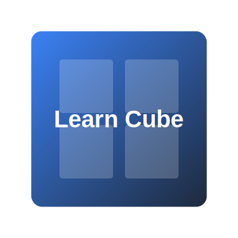

# Learn Cube 🧩

The ultimate open-source platform to master the Rubik's Cube. From your first solve to speedcubing world records.



## ✨ Features

- **Interactive Tutorials:** Step-by-step guides from beginner to advanced methods (CFOP, Roux, ZZ).
- **Interactive Move Visualizer:** Real-time arrow diagrams for every algorithm.
- **Speed Cube Timer:** Built-in timer with scrambler and history tracking.
- **Puzzle Collection:** Guides for 2x2, 4x4, 5x5+, Pyraminx, Megaminx, Skewb, Square-1, and more.
- **Cubing Culture:** History, glossaries, competition tips, and hall of fame.
- **Hardware & Care:** Maintenance, modding, and buying guides.
- **Parental Guide:** Helping parents understand the "clicking" obsession.

## 🚀 Tech Stack

- **Framework:** [Astro](https://astro.build)
- **Documentation Engine:** [Starlight](https://starlight.astro.build)
- **Components:** [React](https://reactjs.org)
- **Styling:** CSS3 & Starlight Custom Themes

## 🛠️ Installation

```bash
# Clone the repository
git clone https://github.com/ramkrishna-js/learn-cube.git

# Install dependencies
npm install

# Start the development server
npm run dev
```

## 🤝 Contributing

This is an open-source project! Whether you're a speedcubing pro or a hobbyist coder, feel free to contribute:
- Add new algorithms or methods.
- Improve existing tutorials.
- Fix bugs in the tools.
- Add more "terrible" cubing jokes.

## 📄 License

This project is licensed under the MIT License - see the [LICENSE](LICENSE) file for details.

---
*Built with ❤️ for the cubing community.*
